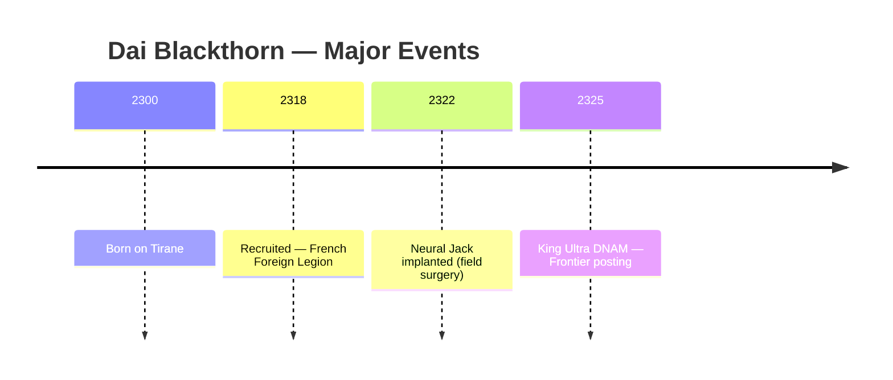

# Brainstorm

*Catch-all scratchpad — architecture, visualisation, content, anything.*

---

## Architecture

### Character tombstone

A "tombstone" record is the minimal set of fields that remain meaningful for as long as the character exists — alive, dead, or retired. The concept comes from physical gravestones (name, dates, origin, epitaph, relationships) and from database practice where a tombstone row marks a deleted entity without losing its identity. For a literary or RPG character the equivalent is the permanent record: not the full play sheet, but the data that answers "who was this person and what mattered about them?" without reading the narrative prose.

**Inspiration sources:**

*Physical tombstone:* full name (including maiden/birth name), birth date and place, death date and place, age at death, spouse names, number of children, occupation or rank, military service, religious affiliation, epitaph.

*GURPS Basic Set (character sheet, p. 335):* Name, Player, Point Total, Height, Weight, Size Modifier (SM), Age, Appearance, Unspent Points — then the four basic attributes (ST, DX, IQ, HT), six secondary characteristics (HP, Will, Per, FP, Basic Speed, Basic Move), DR, TL, Cultural Familiarities, Languages (spoken/written), Reaction Modifiers (Appearance, Status, Reputation), Parry, Block, Advantages & Perks, Disadvantages & Quirks, Skills (name, level, relative level).

*Classic Traveller (TS Space Classic):* Universal Personality Profile — STR DEX END INT EDU SOC each 2–12, expressed as six hexadecimal digits (e.g. 777A86). Career terms served (each 4 years), skills gained per term, age at mustering out, cash/material benefits, ship shares. Aging crises begin after age 34; failed survival rolls kill the character mid-career.

**Recommended tombstone fields for a `characters` table:**

*Identity block* — character_id (opaque key), name, birth_name (if different), aliases (JSON array), player (NULL for NPC or literary), campaign_role (PC / NPC / ALLY / ENEMY / NEUTRAL / LITERARY), status (ACTIVE / DEAD / RETIRED / MISSING / UNKNOWN).

*Origin block* — species_id (FK → species), body_id (homeworld, logical FK → Meridian), culture (TEXT), tl (tech level of origin, INTEGER).

*Vital block* — sex (TEXT, free-form), age_at_creation (INTEGER), birth_date and death_date (campaign seconds from epoch; 0 = pre-dates campaign epoch; NULL = unknown). This mirrors the GURPS convention for ship dates and keeps all timeline arithmetic consistent.

*Physical block* — height_m, weight_kg, sm (Size Modifier, default 0), appearance (TEXT enum or free-form: HIDEOUS / UNATTRACTIVE / AVERAGE / ATTRACTIVE / HANDSOME / BEAUTIFUL).

*Social block* — wealth_level (DEAD_BROKE through FILTHY_RICH, matching GURPS Wealth advantage steps), status_level (−2 to 8), faction (TEXT), rank (TEXT), reputation (TEXT summary — e.g. "Legendary Thief +3 among thieves").

*GURPS attributes* — st, dx, iq, ht (four basic); hp, will, per, fp, basic_speed, basic_move (six secondary, stored only when they differ from the formula defaults — NULLable, derive on read otherwise).

*Point summary* — point_total, points_unspent. Advantages, disadvantage, and skill point subtotals belong in the child tables, not here.

*Narrative bridge* — notes (TEXT, Markdown), obsidian_slug (TEXT UNIQUE).

**Recommended child tables:**

`character_traits` — one row per advantage, disadvantage, perk, or quirk. Columns: character_id, trait_name, level (NULL for binary traits), point_cost, trait_type (ADVANTAGE / DISADVANTAGE / PERK / QUIRK), is_key (boolean — flags the 3–5 traits worth showing in the Obsidian frontmatter summary).

`character_skills` — one row per skill. Columns: character_id, skill_name, level (absolute score), relative_level (TEXT, e.g. "IQ+2"), is_key (boolean for frontmatter summary).

`character_languages` — one row per language. Columns: character_id, language, spoken (NONE / BROKEN / ACCENTED / NATIVE), written (same enum). Mirrors the Languages box on the GURPS sheet.

`character_careers` — one row per career term (Traveller-style). Columns: character_id, career, branch, terms_served, mustering_out_benefit. Useful for NPCs with a history even if the campaign uses GURPS rather than Traveller resolution.

**Obsidian YAML frontmatter template:**

```yaml
---
character_id: dai_blackthorn
name: Dai Blackthorn
birth_name: null
aliases: [the Ghost]
player: null
campaign_role: NPC
status: ACTIVE

species: Human
homeworld: null
culture: "Yrth (Crusades-era)"
tl: 4

sex: M
age: 32
birth_date: 0
death_date: null

height_m: 1.78
weight_kg: 74
sm: 0
appearance: Handsome

wealth: COMFORTABLE
status_level: 0
faction: Independent
rank: null
reputation: "Legendary Thief +3 (thieves)"

st: 11
dx: 15
iq: 13
ht: 12
hp: 11
will: 13
per: 14
fp: 12
basic_speed: 6.75
basic_move: 7
point_total: 250

key_advantages:
  - "Teleportation (ESP, -10%) [44]"
  - "High Manual Dexterity 2 [10]"
key_disadvantages:
  - "Curious (12) [-5]"
  - "Overconfidence (12) [-5]"
key_skills:
  - Filch-17
  - Lockpicking-18
  - Stealth-18
key_languages:
  - "Anglish: Native/Native"

obsidian_slug: dai_blackthorn
---
```

**Design decisions to settle:**

The GURPS secondary characteristics are derived from the four basic attributes by formula (e.g. HP = ST, Will = IQ, Basic Speed = (DX + HT) / 4). Storing them only when they deviate from the formula keeps the table lean but requires the application to know the formula to display correctly. The simpler alternative — always store all ten values — avoids the formula logic in every read path and costs six extra nullable INTEGERs per row, which is negligible at this scale. Recommend always-store.

The Traveller UPP and career record are worth adding even for a GURPS campaign: career history is narrative data that survives system changes, and STR/DEX/END/INT/EDU/SOC can be recorded as notes alongside the GURPS attributes without a schema conflict.

The `epitaph` field (a single memorable line about the character, analogous to a gravestone inscription) is missing from the GURPS sheet but present on every real tombstone. Worth adding as a TEXT column — it becomes the lede of the Obsidian narrative section and doubles as a Dataview-queryable tagline.

### Augmentations

2300AD defines three distinct tiers of augmentation that map cleanly to three different schema concerns. **Cybernetics** are hardware — subdermal electronics, implanted organs, prosthetic and cybernetic limbs, eyes, ears, and neural interfaces. They are surgically installed, have a TL, a cost, a surgery time, a body location, and maintenance requirements. **DNA modifications (DNAMs)** are permanent genetic rewrites via tailored retroviruses; they are Minor (outpatient, ~1 month recovery) or Major (sedation, up to 3 months), carry rejection risk modelled as END checks, and stack dangerously — each additional DNAM after the first adds cumulative penalties to the rejection roll. **Symbionts** are living engineered microorganisms delivered by injection, ingestion, or inhalation; they are revocable (by targeted anti-microbials) but die if removed from their designed environment.

The complete category list for `aug_type`: SUBDERMAL / IMPLANT / NEURAL / CYBERWEAPON / CYBERLIMB / CYBEREYE / CYBEREAR / DNAM / SYMBIONT / PROSTHETIC. Prosthetics are distinct from cyberlimbs — they restore function rather than augmenting it, are legal everywhere, and do not count against Law Level limits. The distinction matters for social reaction rolls and border crossings.

Each `character_augmentations` row needs: aug_type, name, body_location (TEXT, e.g. "left arm", "nape of neck"), tl, status (ACTIVE / REMOVED / REJECTED / DEGRADED), installed_at (epoch seconds), removed_at (NULL if still present), cost_paid, surgery_time_s, provider (TEXT — clinic or surgeon name), is_black_market (boolean — relevant for 2300AD's Black Clinics and Law Level checks). DNAM-specific columns: dnam_type (MINOR / MAJOR), rejection_rolls (count of attempts). Symbiont-specific: delivery (INJECTED / INGESTED / INHALED).

For the Obsidian frontmatter, augmentations are rendered as a YAML list of currently active items (status = ACTIVE, removed_at IS NULL) with name, type, body location, and TL. The full history — including removed and rejected augmentations — stays in the database and feeds a timeline view, not the tombstone snapshot. A character who had a cybernetic arm replaced with a regrown limb should show the arm as removed in history, not erased; the vault file shows only current state.

### Time-keying all character state

Every mutable fact about a character must carry a timestamp. The timestamp is a bigint count of seconds from the campaign epoch, using the same convention already established for ships (0 = pre-dates campaign; NULL = unknown). This gives the entire system a single timeline arithmetic basis — ship commissionings, character augmentations, world settlement events, and campaign incidents are all comparable without conversion.

There are three patterns for time-keyed character data. **Install/remove pairs** apply to anything that is added and may later be removed: augmentations, faction memberships, ranks, equipment assignments. The row has `installed_at` (NOT NULL) and `removed_at` (NULL while active). Querying current state is `WHERE removed_at IS NULL`; querying state at time T is `WHERE installed_at <= T AND (removed_at IS NULL OR removed_at > T)`. **Append-only event log** applies to things that happen once and are never reversed: injuries, experience awards, encounters, travel legs, campaign milestones. Each row has `event_at`, `event_type`, and `description`. **Attribute history** applies to numeric stats that change incrementally over a character's life: ST/DX/IQ/HT and their secondaries can all shift from augmentations, aging rolls, injuries, or experience. Each row records `changed_at`, `attribute`, `old_value`, `new_value`, and `reason`.

The `characters` table itself holds only **current** attribute values for fast read. History is in `character_attribute_history`. This mirrors the approach already used in the species/settlement pipeline where world.db is the current-state source and campaign mutations flow through a separate event table.

**Recommended child tables for time-keyed state:**

`character_augmentations` — install/remove pairs (see above).

`character_events` — append-only log. Columns: event_id, character_id, event_at (bigint), event_type (CREATED / AUGMENTATION / INJURY / HEALING / ATTRIBUTE_CHANGE / STATUS_CHANGE / LOCATION_CHANGE / FACTION_CHANGE / CAREER_EVENT / DEATH / AGING / OTHER), description (TEXT), aug_id (nullable FK for augmentation events), body_id (location at time of event), notes.

`character_attribute_history` — numeric stat changes. Columns: id, character_id, changed_at (bigint), attribute (TEXT, e.g. 'st', 'dx', 'hp'), old_value (REAL), new_value (REAL), reason (TEXT).

`character_locations` — install/remove pair tracking where a character is. Columns: character_id, body_id (Meridian FK), arrived_at (bigint), departed_at (NULL if still present), travel_mode (TEXT). Enables "where was this character when X happened?"

**Epoch choice:** The campaign epoch zero-point should be agreed once and recorded in a settings table — something like `SELECT epoch_note FROM campaign_settings` returning "2300-01-01T00:00:00Z" or a fictional in-universe date. All event timestamps are then offsets from that point in seconds. Using seconds (not days) is correct for a space-opera setting where ship travel times, surgery durations, and combat rounds all matter at sub-day resolution.

**Obsidian frontmatter — time-keyed additions:**

```yaml
# Current augmentations (status=ACTIVE only; full history in DB)
augmentations:
  - name: Neural Jack
    type: NEURAL
    location: "nape of neck"
    tl: 11
    installed_at: 31536000   # epoch seconds

# Status timeline (last known state change)
status: ACTIVE
status_since: 31536000       # epoch seconds

# Current location
location_body_id: sol_earth
location_since: 34128000
```

### Timeline tool

#### What it is

A query-and-render tool that pulls events from the database, applies selection rules, and writes output in one of several formats. It is not a database itself — it is a view layer over the time-keyed event data already described in the character, ship, and settlement schemas. The core of the tool is a composable query that selects events, and a pluggable renderer that formats them.

---

#### Event data model

Every event needs these fields regardless of where it originates:

| Field | Type | Notes |
|---|---|---|
| `event_id` | INTEGER PK | |
| `event_at` | INTEGER | bigint seconds from campaign epoch |
| `event_end` | INTEGER \| NULL | for duration events; NULL = point event |
| `title` | TEXT | short label (used in Mermaid and list headers) |
| `description` | TEXT | narrative paragraph for Obsidian and verbose text |
| `entity_type` | TEXT | CHARACTER / SHIP / SETTLEMENT / FACTION / WORLD / CAMPAIGN |
| `entity_id` | TEXT | opaque key into the relevant table |
| `event_type` | TEXT | BATTLE / AUGMENTATION / POLITICAL / EXPLORATION / DEATH / BIRTH / COMMISSION / DECOMMISSION / TRAVEL / CAREER / OTHER |
| `tags` | TEXT | space-separated keywords for ad-hoc selection |
| `importance` | TEXT | MAJOR / MINOR / BACKGROUND |
| `visibility` | TEXT | PUBLIC / SECRET / RUMOUR — who "knows" the event |
| `known_to` | TEXT \| NULL | JSON array of character_ids for SECRET events |
| `source_ref` | TEXT | see below |
| `body_id` | TEXT \| NULL | where the event happened (Meridian FK) |
| `obsidian_slug` | TEXT \| NULL | link to a vault note that narrates this event |

Duration events (ship commissions, augmentation active periods, career terms, sieges) have both `event_at` and `event_end`. Point events (deaths, battles, discoveries) have only `event_at`. The distinction drives Mermaid gantt vs timeline rendering.

---

#### Source references

The `source_ref` field links each event back to its provenance. This is the killer feature — it answers "where did this fact come from?" A proposed format is a URI-style string:

| Source type | Format | Example |
|---|---|---|
| Campaign session | `session:<number>:<note_slug>` | `session:12:battle_of_tirane` |
| Obsidian note | `obsidian:<slug>` | `obsidian:dai_blackthorn` |
| Rulebook | `book:<short_code>:<page>` | `book:2300AD-1:31` |
| DB record | `db:<table>:<row_id>` | `db:ship_fates:42` |
| GM note | `gm:<free_text>` | `gm:implied by NPC dialogue session 7` |
| Canonical (setting) | `canon:<source>` | `canon:2300AD history` |

Multiple sources can be recorded as a JSON array if needed. The text renderer prints them as footnotes. Obsidian renders them as wikilinks. Mermaid drops them (no room), but the underlying data stays queryable.

---

#### Selection rules

Selection rules compose — any combination of filters ANDed together, with OR groups where needed. Proposed CLI syntax:

```
timeline \
  --entity character:dai_blackthorn \
  --type AUGMENTATION,INJURY,DEATH \
  --from 0 --to 94608000 \
  --importance MAJOR \
  --tag "war combat" \
  --visible-to character:dai_blackthorn \
  --body sol_earth \
  --format text
```

Key selection dimensions:

*By entity* — all events for a character, a ship, a faction, a settlement, or a body. The most common query: "show me everything that happened to this person."

*By time range* — `--from` and `--to` as epoch seconds. Human-readable input (year, campaign date) must be converted by the tool.

*By event type* — BATTLE, AUGMENTATION, POLITICAL, etc. Multiple types are OR'd.

*By tag* — ad-hoc keywords. Multiple tags are AND'd by default (events must have all tags); an `--any-tag` flag switches to OR.

*By importance* — MAJOR-only for summary views; all for detailed logs.

*By visibility / known-to* — `--visible-to character:X` filters to PUBLIC events plus SECRET events where X is in `known_to`. This generates an in-character timeline — what a specific person actually knows.

*By location* — events that happened at a specific body_id or within a system.

*Cross-entity joins* — "all events involving ship X and character Y during period Z." This requires OR on entity_id across entity types, which is a slightly more complex query but straightforward SQL.

---

#### Output formats

**Text list** — simplest output. Chronological, grouped by period (decade, year, month depending on span). Each event is one line at minimum: `[date] [title] — [source_ref]`. Verbose mode adds the description as an indented paragraph. Useful for pasting into session prep docs.

```
[2300-01-15]  Dai Blackthorn receives Neural Jack — session:3:augmentation_log
[2300-03-22]  Battle of Tirane begins — canon:2300AD history
[2300-04-01]  Star Flower departs Tirane — db:ships:12
```

**Obsidian** — generates a single Markdown note with YAML frontmatter listing events as a structured array, suitable for Dataview queries. Each event also gets a wikilink to its `obsidian_slug` if one exists. Alternatively, generates one note per event and links them with `[[backlinks]]` — better for narrative depth but more files to manage. The single-note approach is probably right for campaign prep; the per-event approach is right for published worldbuild lore.

```yaml
---
timeline_query: "character:dai_blackthorn type:MAJOR"
generated_at: 94608000
events:
  - at: 31536000
    title: "Neural Jack implant"
    type: AUGMENTATION
    importance: MINOR
    source: "session:3:augmentation_log"
    note: "[[dai_blackthorn_neural_jack]]"
---
```

**Mermaid** — two diagram types suit different queries. Use `timeline` (Mermaid's native type) for high-level overviews with few events and decade-scale resolution — it renders well in Obsidian and GitHub. Use `gantt` for duration events (ship service careers, augmentation active periods, sieges) where overlapping intervals matter; `gantt` uses numeric offsets from a start date which maps directly to epoch seconds. The tool should choose automatically based on whether the event set contains duration events.

```mermaid
gantt
  title Ship Service Records
  dateFormat X
  axisFormat %Y
  section Star Flower
    Active service : 0, 94608000
  section Deimos-class Frigate
    Laid down : 0, 15552000
    Active     : 15552000, 94608000
```





---

#### Centralised vs distributed event storage

Two architectures are possible. **Distributed**: events live in their entity tables (`character_events`, ship `date_commissioned`/`date_removed`, `system_events` in world.db) and the timeline tool JOINs them all with a UNION query. Each table stays close to its entity, but cross-entity queries are complex and adding a new entity type requires updating the UNION. **Centralised**: a single `timeline_events` table holds all events with an `entity_type` + `entity_id` discriminator; entity tables write into it as well as their own structured columns.

The hybrid is probably right: keep structured data in entity tables (augmentation install/remove pairs, ship commission dates) but mirror a timeline entry into `timeline_events` at write time. The structured tables are authoritative; `timeline_events` is a denormalized read layer. A Python helper `record_event(entity_type, entity_id, event_at, ...)` handles both writes atomically. This keeps the query layer simple without abandoning the relational structure that enforces data integrity.

---

#### Open questions

The tool does not yet have a home in the project structure. `scripts/timeline.py` is the obvious place, consistent with the existing `scripts/` convention. It would take CLI args for selection and `--format text|obsidian|mermaid`, and import from `config.py` for the DB path. Whether it also serves data to the FastAPI server (for a browser timeline view in the Three.js client) is worth deciding early — if yes, the selection-rule logic belongs in a library function, not baked into the CLI argument parser.

The epoch zero-point is not yet defined for the campaign. This needs to be settled before any timestamps are written, since changing it later requires a full table migration. A candidate: campaign year 2300-01-01T00:00:00Z expressed as a Unix timestamp offset, so that real calendar arithmetic works without a custom conversion table.

The visibility/known-to system raises a design question about secrets that become public: when a SECRET event becomes PUBLIC (the spy is revealed, the ship's fate is announced), updating `visibility` loses the fact that it was once secret. An `originally_secret` boolean and a `revealed_at` timestamp would preserve the history of what was known when.

---

## Unorganized

### Three-store architecture

The strict left-to-right pipeline — world.db → Meridian → Obsidian — is a good constraint that prevents circular dependencies, but it raises the question of what happens when Meridian data changes after a world has already been generated. There's no cache-invalidation mechanism today; the Obsidian vault files will silently go stale if a body's physical parameters are updated upstream. Worth deciding whether the pipeline should be re-runnable idempotently (overwrite vault files on re-run) or whether vault files are considered frozen once written. A re-run flag on the generation script would be a low-cost hedge.

### SQLite and world.db

The current scale — dozens to hundreds of species and settlements — is well inside SQLite's comfort zone, and the single-database design avoids cross-database JOIN pain. The deferred story.db split is worth revisiting once campaign play begins: mutations (battles, colonization, extinction events) have a different lifecycle than canonical reference data and could pollute the reference tables if written in-place. The system_events table sketch is a good middle path — a single append-only log inside world.db that records what changed, when, and why, without forking the schema.

### Meridian API boundary

The JSON-to-Pydantic translation happening once at the boundary is the right call — it keeps the rest of the codebase clean and gives IDE support everywhere downstream. The stubs in meridian/api.py mean development can proceed before Meridian is live, which is good, but the stub return values need to be realistic enough to exercise the generation code meaningfully. ShipPosition is flagged as the next model addition; it's worth thinking about whether ship positions are point-in-time snapshots or tracked over a trajectory, since that shapes the model significantly.

### Generation grammar

Encoding GURPS tables as Python StrEnums and weighted-choice dicts rather than database rows is the right call — these are grammar, not data, and they don't benefit from being queryable. The roll_species() pure function design is clean: no I/O inside, easy to unit-test with a seeded RNG. The interesting design question is how much the homeworld Body influences the roll — right now body is typed as `Body | None`, implying it's optional, but a body-aware generator that skews toward cold-adapted or aquatic traits based on the planet would produce more coherent species.

### Obsidian vault output

The YAML frontmatter plus narrative prose structure is well-suited to Dataview queries while keeping the files human-readable. Model tiering by species role (Opus for sapients, Sonnet for beasts, Haiku for things) is a sound cost-quality tradeoff given that PEOPLE entries will be referenced repeatedly in play while THING entries are essentially one-shot. The main risk is frontmatter drift: if the species schema in world.db evolves, the vault files generated before the change will have a different field set, which breaks Dataview queries. Some form of schema version stamp in the frontmatter would help detect this.

### Three.js client visualisation

The client directory exists but is not yet implemented, which means all the design decisions are still open. The obvious first question is what the primary view is: a galaxy map (stellar distances, jump routes), a system view (orbital bodies, settlements), or a tactical/ship view. These have very different data requirements — the galaxy map needs only Meridian system data, the system view needs bodies and settlement overlays from world.db, and a ship view needs dynamic position data that doesn't exist yet. Starting with the system view is probably the right call since that's where world.db and Meridian data intersect most richly.

### FastAPI server

The server exposes starfield and worlds data over HTTP and WebSocket, with one file per data domain in server/routes/. The domain split (systems, bodies, ships) maps cleanly onto the data sources — systems and bodies come from Meridian, ships will come from Meridian's position data, and settlement/species overlays come from world.db. The open question is how the client requests composite data: does it call multiple endpoints and merge client-side, or does the server provide a composed endpoint that joins Meridian and world.db data before returning? Client-side merging is simpler to implement but means the client has to understand both schemas.

### Spaceship schema

The schema is slot-based, faithfully mirroring GURPS Spaceships' 20-slot hull structure: each ship has front, central, and rear sections of numbered slots plus a core slot per section. Power Points are intentionally not stored on the ship record — they're derived by summing the power_points column across the ship's power plant entries in ship_system_slots, which means adding or removing a reactor automatically updates available power without a denormalisation bug. The multi-stage vessel pattern (parent_ship_id self-reference) handles booster stacks and upper stages cleanly, though the convention for which end points to which needs to be settled and documented once the first multi-stage ship is entered. Design bureaus (design_bureaus table) are a nice addition that lets ships be attributed to in-world shipyards, which will matter once industrial capacity and production timelines become campaign-relevant.

### Spacecraft production scaling

The power-law formula (C = k × M^α × T^β) gives a principled way to derive build times from hull mass, ship class, and industrial context without inventing numbers from scratch. The key insight is that α varies by ship class — freighters benefit from economies of scale (α < 1) while capital ships suffer complexity explosion (α up to 1.5) — so the same formula produces plausible results across the whole size range. The calibration anchor (a TL9 Battle-class Frigate at 600 days) is the single number everything else derives from; getting that anchor right is more important than tuning the individual exponents. The settlement table in world.db already provides all the colonial inputs the formula needs (tech_level, population_log, starport_class, resource_value_mod), which means build-time queries can be done as a JOIN with no additional data entry.

### Spaceship production open questions

Three things are unresolved in the scaling model: k_base (the formula's dimensional constant, computed from the calibration anchor once α and β are fixed), the workforce estimate (which needs the linearised model rather than the power-law form), and the shipyard table (construction_env and concurrent_slipways belong on a shipyard record keyed by body_id, not on the settlement). The superscience TL question is resolved — ^ tech is itemised with a hard numeric TL and a faction qualifier, so the standard TL-cap rule applies without a special schema exception. Repair and refit are deferred but will likely reuse the same formula with M replaced by damaged mass and C replaced by repair cost.

### Species schema

The species table covers GURPS Chapter 6 in full — Tables I through IX, from biochemistry and habitat through body plan, locomotion, senses, intelligence, and social structure. The special_senses field is a bitmask (INFRARED=1, ULTRAVIOLET=2, MAGNETIC=4, ELECTRIC=8, PRESSURE=16, ECHOLOCATION=32) which keeps the schema compact but makes querying awkward; a junction table like species_traits might be the cleaner long-term answer for senses too. The campaign_role column (PEOPLE, BEAST, THING, MONSTER) drives model selection in the Obsidian generation pipeline and is probably the most useful single filter for practical campaign use. One open schema question: special_gestation only lists two CHECK values currently; the full Table VI set from the rulebook needs to be audited before any data is entered.

### Lifeforms generation pipeline

The plan proceeds in five phases: Python enums for the GURPS tables, hand-crafted test fixtures, a smoke-test run of the Obsidian generator against those fixtures, integration into the body generation flow, and finally a bulk batch run starting with PEOPLE species. The most important unresolved design question is what triggers species generation — either any world above a life_complexity threshold gets fauna candidates automatically, or generation is driven by an explicit authored list. The automatic approach produces more coverage but also more noise; the authored list gives full editorial control but requires manual effort for every species. The Batch API strategy (async submission, 50% cost reduction, Opus/Sonnet/Haiku tiering by role) is already settled and sensible.

---

## History

### Concepts

**Secular cycles are a feature, not a bug.** Turchin's demographic-structural model generates instability cycles with a period of roughly 100–150 years from two simple feedback loops: population grows against a carrying capacity ceiling (generating relative immiseration as the ceiling is approached), and elite competition grows faster than available high-status positions (generating intra-elite conflict). The two loops interact: elite overproduction peaks near the population ceiling, which is when the state is least able to absorb the conflict. In a campaign setting, this means every mature world has a phase — and knowing that phase tells you what kind of political crisis is next.

**Frontier asabiya.** Turchin's most striking empirical finding is that >90% of mega-empires formed on steppe frontiers, not in wealthy cores. The mechanism is Ibn Khaldun's asabiya: groups under sustained pressure from a hostile environment develop the group solidarity, sacrifice ethic, and military cohesion that lets them conquer their prosperous but fractious neighbours. In a sci-fi setting the analogue is the founding generation of a colony — a small population facing a lethal environment, rationing life support, utterly dependent on mutual trust. Frontier colonies are high-asabiya polities. As the environment is tamed and prosperity grows, asabiya erodes on the same timescale Turchin documents: one to two generations for the founding ethos to become nostalgia, two to three for it to become mythology. A world that was forged in hardship will be soft within a century of achieving self-sufficiency.

**FTL comm-lag as asabiya firewall.** In any setting where faster-than-light communication is costly, slow, or impossible, isolated worlds develop independent asabiya pools. They do not cycle in synchrony with the homeworld or with each other. This means an interstellar empire is a mosaic of populations at different phases of their secular cycles: one colony is in its vigorous Conquests phase, another in Decadence, a third has just dissolved in civil war and is re-cohering around a new founding myth. The empire's apparent unity conceals this desynchronisation. The structural implication is that the empire is most stable when its peripheral worlds are in their low-asabiya affluent phases (compliant, trade-dependent, not interested in rebellion) and most threatened when a frontier world hits a high-asabiya peak and begins looking inward at an empire it now has the cohesion to challenge.

**Two-timescale oscillation: Turchin inside Glubb.** Glubb's "Fate of Empires" framework identifies a one-way arc of roughly 250 years from Pioneers through Conquests, Commerce, Affluence, Intellect, and Decadence — after which the polity dissolves and a successor arises, usually from the frontier. Turchin's secular cycles are shorter (~150 years) and damped oscillations, not a one-way ramp. The two models nest cleanly: a Glubb-arc empire undergoes one to two full Turchin cycles between founding and dissolution. The first secular crisis typically occurs during the Commerce or Affluence phase, when population has recovered from the founding hardships and elite overproduction is growing. The second — if the empire survives the first — arrives near the Intellect phase, in a population now sophisticated enough to theorise about its own decline. By Decadence, both loops are at peak amplitude: maximum population pressure, maximum elite competition, minimum state capacity, minimum asabiya. Dissolution follows.

**Elite overproduction in colonial meritocracies.** Turchin's variable E (elite overproduction) measures the gap between the number of aspirants to elite status and the number of elite positions available. In a frontier colony, this gap is small: the founding group is tiny, positions are created as fast as people can fill them, and competence is the primary qualifier because incompetence kills. As the colony matures, the educated fraction of the population grows faster than elite positions, because elite positions scale with the administrative complexity of the polity (slowly) while educated aspirants scale with population and education investment (faster). Colonial meritocracies generate high aspirant density particularly fast: they valorise education, they celebrate social mobility, and they export their overproduction problem upward to the empire — which then has to absorb it. An imperial capital surrounded by aspirant-rich colonies is accumulating structural instability. GURPS Realm Management's Education Rating is the mechanical proxy: high ER combined with moderate Revenue (not enough patronage slots) is the fingerprint of high E.

**Carrying capacity as the settable dial.** In Earth history, carrying capacity K is determined by soil, rainfall, and disease environment — roughly fixed on political timescales. In a space-opera setting K is a design parameter: terraforming expands it, orbital habitats raise it above planetary limits entirely, a plague or asteroid impact can collapse it in a single event. This means the demographic pressure variable (N/K − 1) can be reset by technology. A world approaching its ceiling can defer the crisis by building orbital capacity or accelerating terraforming. This is politically useful: the faction that controls the terraforming programme controls the pressure valve, and therefore controls when the secular crisis is triggered. Similarly, a world that suffers a sudden K collapse (nuclear exchange, ecological catastrophe, supply chain severance) will experience immediate population-exceeds-K conditions — instant demographic pressure — without going through the slow growth ramp Turchin documents. This is a fast-track to instability that bypasses the normal century-scale buildup.

**GURPS Realm Management as a mechanical substrate.** The Disruptions and Windfalls tables in Realm Management are stochastic shocks that move a polity's stats from one turn to the next. Mapped to Turchin's framework, Disruptions are events that move the system toward the instability peak (Plague reduces population and IR; Civil Unrest reduces Citizen Loyalty; Corruption reduces Revenue and Management Skill; Political Schism reduces ConR). Windfalls are counter-forces (Expansion increases Agriculture and Workforce Points; Political Stability increases ConR and Loyalty). The Revolution and Dissolution triggers (ConR check when instability peaks, regime change or polity dissolution) are the Turchin crisis event in mechanical form. A campaign can use the Realm Management monthly turn structure to advance the political state of each world automatically — rolling Disruptions, applying results, checking thresholds — while the Turchin framework tells the GM when to expect a threshold to be crossed and what it will look like narratively.

**GURPS Future History cycle taxonomy.** The Future History chapters distinguish five cycle types that operate on different timescales and can be layered: *economic cycles* (decades, driven by investment/deflation rhythms), *generational cycles* (30–40 years, driven by cultural memory and its loss), *civilizational cycles* (centuries, Glubb-scale), *illuminated/directed cycles* (polities deliberately engineered to follow a plan — the Seldon Foundation problem), and *natural cycles* (climatic, astronomical — exogenous to human politics). For a sci-fi campaign the most useful are the economic and generational cycles as the fast oscillations within a Turchin secular cycle, and the civilizational cycle as the envelope. The illuminated cycle is the setting's most interesting possibility: what happens when a faction knows the Turchin equations and tries to manage its secular crisis consciously? History suggests this works, at best, for one cycle.

**GURPS Social Engineering — mass movement mechanics.** A Turchin instability peak is not just a number on a stat sheet — it manifests as mass movements: religious revivals, revolutionary vanguards, populist uprisings, succession crises. Social Engineering's Moving the Masses and Power Struggles chapters describe the mechanics of how individuals convert, how factions recruit, how a charismatic leader propagates influence. The autocatalytic conversion model (each convert creates converts) matches Turchin's description of how asabiya spreads along frontiers and how revolutionary movements accelerate near the crisis peak. In game terms: when I is high and A is low, the Social Engineering mechanics for mass conversion run at their most effective. A GM can use the Realm Management disruption table to detect that the polity is entering an instability window, then switch to Social Engineering mechanics to resolve how that instability manifests at the character level.

---

### Variables

Turchin's model has five core variables. Each maps to a physical reality, to a GURPS Realm Management stat, and to something measurable at the campaign table.

---

**N — Population**

*Physical meaning:* Absolute population count, but more usefully: population relative to K. The destabilising quantity is not N itself but (N/K − 1) — the degree to which the population exceeds the sustainable ceiling. When this ratio is positive, relative immiseration follows (more people competing for the same productive base), which is the first input to instability. In a space-opera context N must be defined per-world or per-habitat — a world of 10^9 people is quite different from an orbital with 10^4.

*Realm Management stat:* `Population` (the explicit stat). In world.db: `world_settlement.population_log` (log₁₀ of persons, 0–13).

*Campaign usage:* Population growth rate (ΔN/turn) is the leading indicator. RM's monthly turn doesn't model demographic change directly; house-rule a slow annual change to Population based on Habitability, Agriculture Points, and Workforce Points. A world where Population is growing but Agriculture Points are flat is building demographic pressure. Track the ratio: if Population log is approaching the implied Agriculture + Habitability ceiling, expect a Turchin crisis within two to three generations of campaign time.

---

**E — Elite Overproduction**

*Physical meaning:* The ratio of aspirants to elite-status positions. "Elite" means anyone whose social ambitions require institutional sponsorship — officers needing commands, lawyers needing partnerships, academics needing chairs, politicians needing seats. When population grows, the educated fraction grows with it, but elite positions scale with administrative complexity, not population. The excess aspirants form a frustrated educated class that is the primary engine of revolutionary leadership in Turchin's model — they have the skills to organise, the connections to recruit, and the grievance to motivate.

*Realm Management stat:* Education Rating (ER) × population growth rate, divided by available high-status positions (which grow with Revenue and IR). No direct RM stat encodes E, but the fingerprint is high ER + moderate or declining Revenue + growing Population. Political Schism and Demagogue disruptions in the RM Disruptions table are the mechanical expression of high E: they arise when educated aspirants have no legitimate channel for their ambitions.

*Campaign usage:* A world with ER ≥ 4 and Revenue that hasn't grown in five years is accumulating elite overproduction. The demagogue NPC arrives when E is saturated: someone with the talent and connections of an aspirant who has concluded the system will not reward them through legitimate channels. Track the political factions in the world: are there more faction leaders than there are meaningful power positions to hold? That surplus is E made visible.

---

**S — State Strength (fiscal-military capacity)**

*Physical meaning:* The state's ability to project power — to pay soldiers, maintain courts, suppress rebellion, and fund patronage networks that co-opt potential elites. S is primarily fiscal: a state that cannot collect taxes cannot pay troops, and troops who are not paid defect or pillage. S has a secondary administrative dimension: even with money, a state that cannot actually deliver orders to its provinces is weak. In a space-opera setting, the administrative reach limitation is literal — a world three jump-weeks from the capital has high autonomy not by design but by physics.

*Realm Management stats:* Revenue (primary), Military Resources (coercive capacity), Management Skill (administrative efficiency), Infrastructure Rating (physical capacity to project power — roads, starports, communication infrastructure). The Revolution trigger in RM fires when ConR + a modifier drops to zero — that modifier is the GM's assessment of state capacity, which S represents.

*Campaign usage:* S collapses faster than it is built. Revenue eroded by Corruption disruptions, Military Resources consumed by civil unrest suppression, Management Skill declining as competent officials are purged in faction struggles — these pile up. A polity where S is declining while E is growing is approaching a threshold. The Dissolution trigger (polity breaks apart rather than experiencing a revolution) fires when S → 0 and there is no single aspirant faction strong enough to seize the whole; each faction holds a piece. This is the Turchin secular crisis endgame.

---

**A — Asabiya (social cohesion)**

*Physical meaning:* The collective willingness of a group to sacrifice individual interest for group survival. It is not loyalty to a government — it is solidarity with a people. High asabiya means citizens will work, fight, and starve for each other without being paid to do so. It is highest in newly formed groups facing an existential threat (frontier colonies, religious movements, military units in combat) and erodes with security and prosperity. Turchin models asabiya as decaying over time in any group that achieves dominance: success removes the selection pressure that built the cohesion.

*Realm Management stats:* Citizen Loyalty (direct proxy — the population's attachment to the current polity) + Conformity Rating (the degree to which the population is willing to act collectively rather than defecting to individual strategies). Openness Rating is an inverse indicator: very high Openness means internal diversity, which may correlate with low asabiya for the core group even as it correlates with innovation. Asabiya is not the same as Loyalty to the government; a colony can have high asabiya (strong mutual solidarity) and low Loyalty (rebellion against the empire). The distinction matters: a revolutionary movement is high-asabiya by definition.

*Campaign usage:* Asabiya manifests at the table as whether NPCs cooperate under crisis. On a world with Citizen Loyalty ≥ 4 and ConR ≥ 3, NPCs self-organise in emergencies, accept rationing, and resist outside interference with collective action. On a world with Loyalty ≤ 1 and ConR ≤ 1, every NPC is a potential defector, information leaks immediately, and collective action requires either leadership charisma (Social Engineering mechanics) or coercion (Military Resources). The transition between these states is the asabiya decay arc — one campaign generation.

---

**I — Sociopolitical Instability**

*Physical meaning:* The rate at which political violence, elite conflict, and institutional breakdown events occur. Turchin's historical data (Table 2) shows instability at 0.6 episodes per decade during population growth phases versus 3.8 per decade during population decline — a 6× ratio. Instability is not the cause of a secular crisis; it is the symptom. High I is the signal that E and low S and low A have combined beyond the stabilising capacity of the state. In game terms, I is what the players see: coups, assassinations, civil wars, schisms, famines.

*Realm Management stats:* Disruptions table frequency. In RM, Disruptions are rolled on a fixed schedule — the monthly turn — but their severity and type depend on the polity's stats. The proxy for I is: how many of the past N turns produced Disruptions, and of what severity? A polity rolling Disruptions every other turn is at high I. The specific Disruptions that signal high I are Political Schism, Civil Unrest, Demagogue, and Corruption — the ones that reduce ConR, Loyalty, Revenue, and Management Skill simultaneously, creating the feedback that makes I self-reinforcing once it starts.

*Campaign usage:* High I is a campaign generator. Use the RM Disruptions table mechanically for worlds the party is visiting or tracking, and read the results through Turchin's lens: Civil Unrest is N pressing against K; Political Schism is E seeking new channels; Demagogue is a high-E aspirant converting frustrated aspirants into a movement. The question to ask at each Disruption: is this a temporary shock (Windfall next turn likely) or is it the system entering the instability peak? The answer depends on the underlying variable values. A Disruption in a high-S, high-A, low-E world is noise. The same Disruption in a low-S, low-A, high-E world is a turning point.

---

**K — Carrying Capacity**

*Physical meaning:* The maximum population that the productive base can sustain at current technology. K is determined by food production, energy supply, habitat space, and water supply. In planetary ecology it is largely fixed on political timescales. In a sci-fi setting it is a design parameter: terraforming, orbital habitats, hydroponics, imported food, and increased TL can all raise K, while war, ecological catastrophe, supply chain severance, or blockade can collapse it. The demographic pressure term is (N/K − 1): positive means the population has exceeded the sustainable ceiling and is generating immiseration; negative means there is slack and the population is below the crisis zone.

*Realm Management stats:* Agriculture Points × Habitability (food production ceiling) plus Workforce Points × TL (industrial production ceiling) plus Starport class (import capacity — a high-class starport effectively raises K by allowing food and resource imports). In world.db: `world_settlement.habitability`, `world_settlement.resource_value_mod` (which feeds the production scaling formula), `world_settlement.starport_class`, `world_settlement.tech_level`.

*Campaign usage:* K is the least visible variable to players but the most important for the GM. A world where Agriculture Points have been stable for twenty years while Population has grown is a world where (N/K) is rising invisibly. The first visible signal is often a Famine or Resource Shortage disruption — K failing to keep up with N. Terraforming programmes are political events: whoever controls the terraforming rate controls when the next secular crisis fires. A faction that deliberately slows terraforming (keeping K just below N) is generating the immiseration that will fuel their revolutionary movement. A faction that accelerates it (K > N) is buying time, defusing the pressure, and making itself indispensable to the population's survival — classic Seldon manoeuvre.

